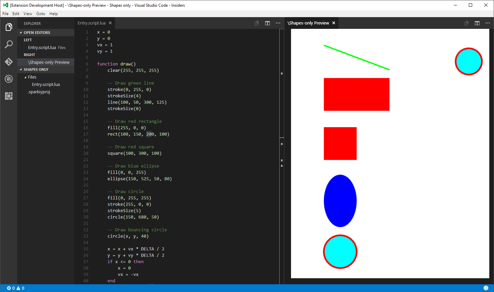

# sparkiy-vsc 

Visual Studio Code preview provider extension for sparkiy.

_This extension is inteded for documentation contributors only._ 

## Features

- Auto-detect sparkiy projects (opens the preview pane)
- Run sparkiy scripts right from the Visual Studio Code editor
- Integrated LUA VM
- Uses WebGL to render visuals  

## Requirements

- Latest version of Visual Studio Code

## Usage

- Close this repository
- Open the repository directory with Visual Studio Code
- Pressing F5 will open new instance of Visual Studio Code with extension enabled
- Navigating to sparkiy project directory will open preview and run the scripts from `Files` folder of sparkiy project

_To reload the sparkiy script (and preview), press CTRL+R in extension VSC instance_

## Known Issues

Rendering is not optimized and will stutter with larger amount of elements.

Not whole sparkiy API is supported in web documentation nor by this extension.

## Release Notes

### Version 0.0.1

Initial version; contains basic elements and limited sparkiy API.

**Enjoy!**
